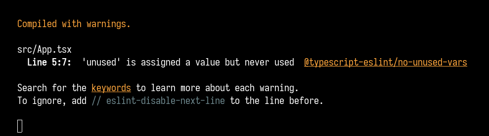

# Testing for [facebook/create-react-app#10170](https://github.com/facebook/create-react-app/pull/10170)

_Note: the directory names refer to the version of `react-scripts`_

TLDR: having both `react-scripts@4.0.2` and `eslint-webpack-plugin@2.5.0` causes no warnings to appear

## Setup (eslint-webpack-plugin@2.4.3)

The `main` branch uses a base TypeScript template built using `create-react-app --template typescript`. The only change was adding `const unused = 5;` to `App.tsx`.
- Both apps on this branch use the dependencies initially installed by `create-react-app`
- Notably, `eslint-webpack-plugin` is at version `2.4.3`

## Result

Both apps correctly show the expected warning from eslint:

## Setup (eslint-webpack-plugin@2.5.0)

The `updated` branch uses the same base templates which have been upgraded by running the following commands:
- `rm -rf node_modules yarn.lock`
- `yarn install`
- Notably, `eslint-webpack-plugin` is at version `2.5.0`

## Result

v4.0.1 correctly shows the expected warning:

v4.0.2 doesn't show any warnings:

